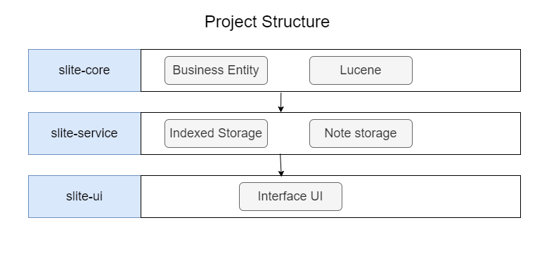

### README

[English](README.md) | [中文](README_ZH.md)

### Slite

Slite is a lightweight search software developed based on java, which can quickly realize the search of custom index text, and the project is based on [Lucene](https://lucene.apache.org/)
Engine implementation.
It is mainly used to assist in prompting, and you can quickly find some commonly used fragment knowledge。

### How it works

+ Search for index information

+ 

+ Enter index information

+ 

### Project structure



### Settings

| Function                   | Description                                                                                        | 
|----------------------------|----------------------------------------------------------------------------------------------------|
| Language switching         | Tray --> right click --> settings --> basic settings, you can do Chinese/English language settings | 
| Custom storage directories | Tray --> right-click --> settings--> basic settings, you can set the storage directory             | 
| System shortcuts           | Tray-->Right Click--> Settings--> shortcut keys, you can set system shortcut keys                                                                     | 

### Build

Found in slite-core [install.bat](slite-core%2Flib%2Finstall.bat) execution, or in the console

```shell
mvn install:install-file -DgroupId=cn.note.swing -DartifactId=note-swing-core -Dversion=1.0.2 -Dpackaging=jar -Dfile=note-swing-core-1.0.2.jar
```

> ps:swing-core-1.0.2.jar It's a fast-food-style jar with some not-so-elegant swing components built-in. Mainly less elegant in custom UI styling and internationalization.

### Packaged

Based on javapackager, in Maven Pom，This parameter is configured to package as a Windows installation package。 During the installation process, innosetup needs to be configured,
And innosetup does not support Chinese, you can copy[ChineseSimplified.isl](resources%2FChineseSimplified.isl)to innosetup Languages DIRECTORY。

JavaPackager supports multiple platforms，Pack if needed mac、linux，More references：[JavaPackager](https://github.com/fvarrui/JavaPackager)
