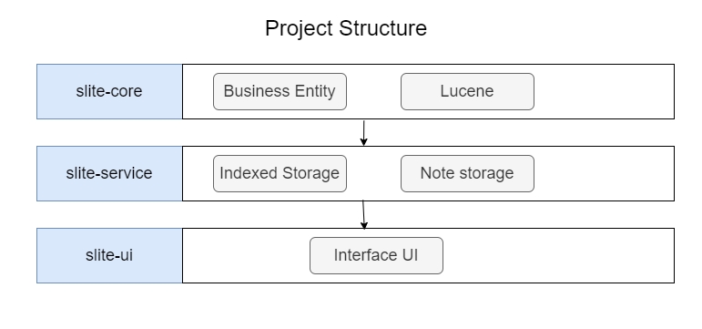

### README

[English](README.md) | [中文](README_ZH.md)

### Slite

Slite是一个基于java开发的轻量搜索软件, 可以快速实现对自定义索引文本的搜索, 项目基于[Lucene](https://lucene.apache.org/)
引擎实现。
它主要是用来辅助提示作用,可以快速查找一些常用的片段知识。

### 操作方式

+ 搜索索引信息


+ 录入索引信息

+ 

### 项目结构



### 设置

| 功能        | 描述                                | 
|-----------|-----------------------------------|
| 支持切换语言    | 托盘-->右键-->设置-->基础设置,可以进行中文/英文语言设置 | 
| 支持自定义存储目录 | 托盘-->右键-->设置-->基础设置,可以进行存储目录设置    | 
| 自定义系统按键   | 托盘-->右键-->设置-->按键设置,可以进行系统快捷键设置   | 

### 构建

在slite-core中找到[install.bat](slite-core%2Flib%2Finstall.bat)执行,或者在控制台执行

```shell
mvn install:install-file -DgroupId=cn.note.swing -DartifactId=note-swing-core -Dversion=1.0.2 -Dpackaging=jar -Dfile=note-swing-core-1.0.2.jar
```

导入IDEA中默认使用
> ps:swing-core-1.0.2.jar 是一个快餐式的jar包，内置了一些不太优雅的swing组件。主要在自定义UI样式和国际化上不太优雅。

### 打包

基于javapackager ，在Maven Pom中，配置了打包为windows安装包的方式。 在安装过程中，需要配置innosetup,
而innosetup不支持中文，需要拷贝[ChineseSimplified.isl](resources%2FChineseSimplified.isl)至innosetup的Languages 目录下。

javapackager支持多平台，可以打包为mac、linux，更多参考文档：[JavaPackager](https://github.com/fvarrui/JavaPackager)

### 下载

下载免安装包: [Slite](https://github.com/nenoxj/SLite/releases/latest)